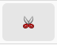

# Create your first chamber

Rooms, corridors and (any type other enclosed space) are called *chambers* in DungeonPlanner.
Chambers are the fundemental building blocks of any dungeon.
A chamber might have doors and objected related to them, but these are added in later steps.

To create a new chamber use the "New Chamber" tool. Alternatively you can use the shortcut `Alt+C`.

This will add a new chamber to the chamber list in the navigation on the left side.
The editor will change to the "append" mode for the newly created chamber.

## Drawing a chamber

After creating a new chamber you can add corners to it by simply clicking in the edior.
If you somehow exited the "append" mode, select the chamber in the list on the left and use the "Append Chamber" tool. 
Corners will always be snapped to the grid.

## Fixing Errors

While working on your dungeon at some point you will need to change a chamber.
This can be done using the "Split Wall" and "Remove Corner" tools

### Splitting a Wall

If you need to add a corner somewhere in the chamber use the "Split Wall" tool.
Select the chamber you want to modify (by using the chamber list or using the "Select" tool) and activate the "Split Wall" tool.
The shortcut for this is `Alt+F`.
 
 
