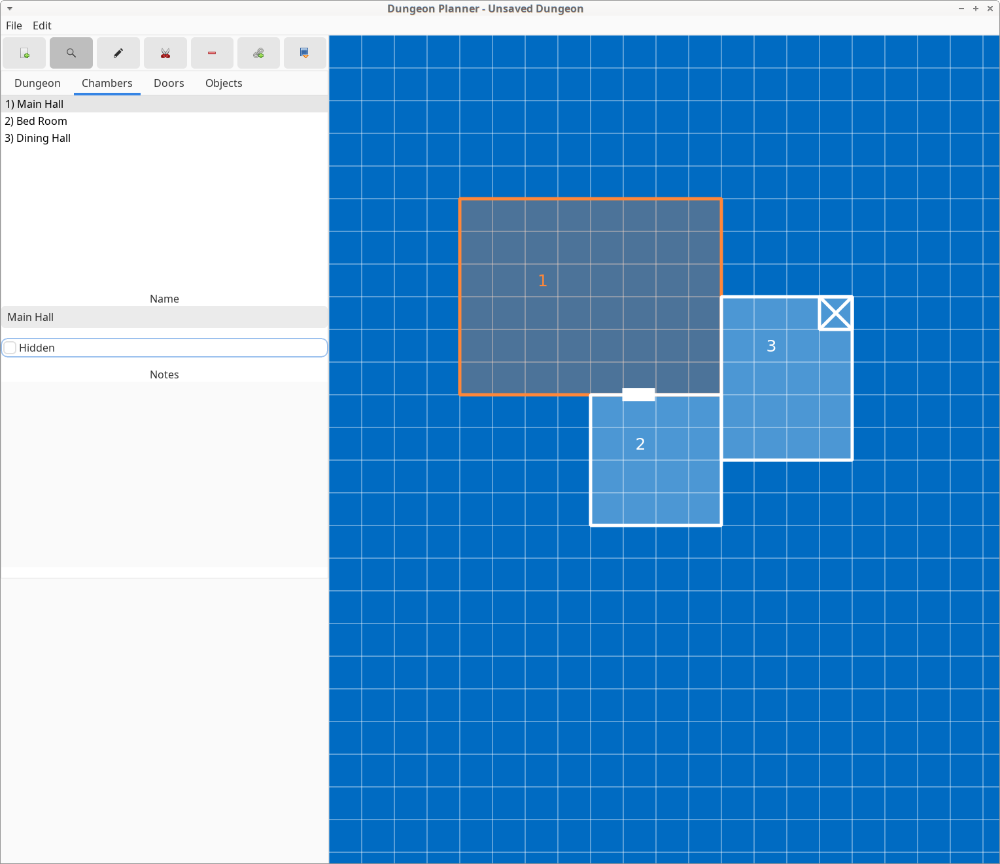

# Dungeon Planner

{ align=right width=200}

Dungeon Planner is a small and simple tool to plan and organize dungeons for tabletop games.
Dungeons are composed out of chambers and doors, for which notes can be added.
The application is game system agnostic and can be used for any system.
Dungeons can be exported as PDF.

