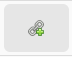

# Adding Doors

Afer creating some chambers you can connect them with doors.
Doors are always part of a room and can reference a second room.

## Placing Doors 

To place a door first select the chamber it should be part of.
Then activate the "Add Door" tool by clicking the icon (shown above) or using the shortcut `Alt+D`.

When you move your mouse over the dungeon editor the nearest wall will be highlighted.
Move to the wall on which the door should be placed and click once.
Afterwards the door will be shown.
Move the door to the desired location and click once again.

## Door Details

In the "Doors" tab (below the tools on the left side) you can find all placed doors.
When you select a door it will be hightlighted in the editor and its details will be shown below the list.

In the details you can change the name and notes.
Doors are only added to the PDF export if name or notes are changed.
Otherwise the door will be drawn but not listed in the notes section of the PDF.

Doors can also be marked as hidden, which will change the shape and editor and PDF Export.
Hidden doors will not be included in the player map export.

The field "Leads to chamber" shows the other chamber this door is connected to.
The field will be filled in automatically based on the shared wall between chambers, but it can also be set manually.
In the PDF export the door will be listed for both chambers it is connected to.