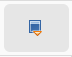

# Adding Objects

For the final touch we want to add objects to the dungeon to mark the location of significant objects and structures in the dungeon

## Placing Objects 

To place an object activate the "Add Object" tool by clicking the icon in the toolbox.
When you move your mouse over the dungeon editor it will show a box with an "X" where the object will be placed.
Click once to place the object.
The appearance of the object can be changed in the next step.

## Object Details

In the "Objects" tab (below the tools on the left side) you can find all placed objects.
When you select an object it will be hightlighted in the editor and its details will be shown below the list.

In the details you can change the name and notes.
Objects are only added to the PDF export if name or notes are changed.
Otherwise the door will be drawn but not listed in the notes section of the PDF.

The style of objects can be changed to one of three predefined shapes.
These can be used to mark different types of objects.

Objects can also be marked as hidden, which will change the shape and editor and PDF Export.
Hidden objects will not be included in the player map export.

