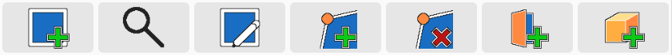

# Quickstart

The editor is split into two parts.
On the left you have the toolbox, navigation and object details.
The dungeon editor where you can edit and see the layout of your dungeon is on the right.

## Tools

The dungeon can be modified using these tools:

###  **New Chamber** (`Alt+C`)

Adds a new chamber (or room) to the dungeon.
The editor mode is changed to "append".
Clicking in the dungeon editor will add a new edge to the dungeon.

###  **Selection** (`Alt+S`)

Allows you to select chambers, doors and objects using the dungeon editor.
The navigation will jump to the selected entity.

###  **Append Chamber** (`Alt+A`)

*Requires a selected chamber.*

Changes the edit mode to "append", to add edges to "the end" of the active chamber.

###  **Split Wall** (`Alt+F`)

*Requires a selected chamber.*

Changes the edit mode to "split", to add corners to existing walls of the active chamber.
The first click will select a wall to be split.
The second click places a new corner.

###  **Remove Corner**

*Requires a selected chamber.*

Changes the edit mode to "remove", to remove corners from the active chamber.

###  **Add Door** (`Alt+D`)

*Requires a selected chamber.*

Changes the edit mode to "add door", to add a door to the active chamber.
The first click will select the wall on which the door should be placed.
The second click sets the position of the door on the wall.

###  **Add Object**

Changes the edit mode to "add object".
Clicking anywhere in the dungeon editor will add a generic object to the dungeon.
The shape of the object can be changed afterwards using the object details on the left side.

