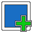

# Create your first chamber

Rooms, corridors and (any type other enclosed space) are called *chambers* in DungeonPlanner.
Chambers are the fundemental building blocks of any dungeon.
A chamber might have doors and objected related to them, but these are added in later steps.

## Creating a new chamber 

To create a new chamber use the "New Chamber" tool. Alternatively you can use the shortcut `Alt+C`.
This will add a new chamber to the chamber list in the navigation on the left side.
The editor will change to the "append" mode for the newly created chamber.

## Drawing a chamber 

After creating a new chamber you can add corners to it by simply clicking in the edior.
If you somehow exited the "append" mode, select the chamber in the list on the left and use the "Append Chamber" tool.

Move your mouse into the editor area.
You should see a dot indicating where the first corner of the room will be placed.
Click once to place a corner on the canvas.
Corners will always be snapped to the grid.

When you move your mouse again you will see the first wall following the cursor.
Move to the desired location for the next corner and click again to place the next corner.
Repeat this process until your first chamber is finished.

## Fixing Errors

While working on your dungeon at some point you will need to change a chamber.
This can be done using the "Split Wall" and "Remove Corner" tools

### Splitting a Wall  

If you need to add a corner somewhere in the chamber use the "Split Wall" tool.
Select the chamber you want to modify (by using the chamber list or using the "Select" tool) and activate the "Split Wall" tool.
The shortcut for this is `Alt+F`.

When you move you mouse over the editor area you will see the nearest wall highlighted in red.
Move your mouse close to the wall you want to split in two and click once.
Afterwards you will see where the new corner will be placed.
Move to the desired location and click again.

### Removing a Corner 

The second way to modify an existing chamber is to remove corners.
Select the chamber you want to modify again and activate the "Remove Corner" tool.

When you move you mouse over the editor area you will see the nearest corner highlighted in red.
Move your mouse to highlight the corner you want to remove and click once.
This will remove the corner.

## Chamber Details

A chamber is more than a shape.
When you select the chamber (either in the list or by using the select tool) the details will be opened on the left side.
Here you can change the name and notes of the chamber.
Name and notes will be used in the PDF Export.

You can also mark the chamber as "hidden".
This will change the outline in the editor to a dashed line.
Hidden chambers will not be included in the "Player Map".
